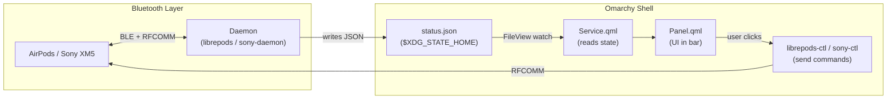

# Omarchy Plugin for Sony WH-1000XM5 — Feasibility & Implementation Plan

## Goal

Create an **Omarchy bar-widget plugin** (working name: `omarchy-sony`) that manages Sony WH-1000XM5 headphones directly from the Omarchy status bar — inspired by [omarchy-pods](https://github.com/thisisgm/omarchy-pods), which does the same for AirPods.

---

## Architecture: How omarchy-pods Works (and What We'd Copy)

The omarchy-pods plugin follows a clean **daemon + panel** pattern:



### Key Files in omarchy-pods

| File | Purpose | Sony Equivalent |
|------|---------|-----------------|
| `manifest.json` | Plugin registration (id, kinds, entryPoints) | Same structure, different id |
| `Panel.qml` | Bar widget UI + dropdown panel | Same pattern, Sony-specific controls |
| `Service.qml` | Watches `status.json`, exposes properties | Same pattern, different properties |
| `Model.js` | Data parsing, enums, no QML imports | Sony-specific protocol enums |
| `AirPodsIcon.qml` | Device icon SVG paths | Sony headphone icon |
| `setup` | Builds daemon, installs systemd service | Same, but builds Sony daemon |
| `daemon/` | Modified librepods (C++/Qt, BLE) | **This is where all the hard work is** |

---

## Difficulty Assessment

### Overall Verdict: 🟡 Medium — mostly integration work, not new research

The Sony Bluetooth protocol is **already reverse-engineered** and implemented in multiple open-source projects. The Omarchy plugin framework is well-defined. The challenge is gluing them together properly.

### Breakdown by Component

| Component | Difficulty | Effort | Why |
|-----------|-----------|--------|-----|
| **manifest.json** | 🟢 Trivial | 10 min | Copy from omarchy-pods, change IDs |
| **Panel.qml** (UI) | 🟡 Medium | 2–4 hours | QML layout work; simpler than AirPods (no per-pod, no case) |
| **Service.qml** (state watcher) | 🟡 Medium | 1–2 hours | Same FileView pattern, different properties |
| **Model.js** (data model) | 🟢 Easy | 1–2 hours | Simpler device — no left/right pod, no case lid |
| **Icon** | 🟢 Easy | 30 min | SVG path for over-ear headphone shape |
| **setup script** | 🟢 Easy | 30 min | Install deps, build daemon, enable service |
| **Daemon (Bluetooth backend)** | 🟡–🔴 Medium-Hard | 1–3 days | **The bulk of the work** — see below |

### The Daemon — Three Approaches

This is the crux. The daemon needs to:
1. Connect to the XM5 over Bluetooth RFCOMM
2. Read battery level, ANC mode, EQ state
3. Write status.json whenever state changes
4. Accept commands (set ANC, set EQ, etc.)

#### Option A: Wrap `sony-headphones-control-py` (Easiest — 1 day)
```
Difficulty: 🟢 Easy
```
- Write a small Python daemon that:
  - Runs `sony-headphones-control-py` commands for ANC toggle
  - Polls battery via Bluetooth (or reacts to BlueZ D-Bus signals)
  - Writes `status.json` in the omarchy-pods format
  - Exposes a `sony-ctl` CLI for the panel to call
- **Pros**: Fast to build, Python is easy to debug
- **Cons**: Polling instead of event-driven; limited to what the Python lib supports; extra Python dependency

#### Option B: Fork mos9527/SonyHeadphonesClient into a daemon (Medium — 2–3 days)
```
Difficulty: 🟡 Medium
```
- The mos9527 fork already has the full v2 protocol for XM5 (ANC, Ambient, EQ, battery)
- Strip out the GUI, keep the Bluetooth protocol layer
- Add a JSON status file writer + CLI command interface
- Build as a C++ daemon with cmake (same toolchain as omarchy-pods' librepods)
- **Pros**: Full feature coverage; same build system as omarchy-pods; event-driven
- **Cons**: More C++ work; needs understanding of the SonyHeadphonesClient codebase

#### Option C: Write a new Rust/Python daemon from protocol docs (Hardest — 1 week+)
```
Difficulty: 🔴 Hard
```
- Implement the Sony v2 RFCOMM protocol from scratch using the reverse-engineered docs
- **Pros**: Clean codebase, exactly the features you want
- **Cons**: Significant effort; protocol already implemented elsewhere

> [!TIP]
> **Recommendation: Option B** — Fork mos9527's codebase. It already handles the hard part (Sony v2 protocol with XM5 support), and the build system (cmake + Qt) is identical to what omarchy-pods uses for its librepods daemon.

---

## What the Sony Plugin Would Show vs. AirPods

The Sony XM5 is a **simpler device** than AirPods Pro from a control perspective:

| Feature | AirPods (omarchy-pods) | Sony XM5 (omarchy-sony) |
|---------|----------------------|------------------------|
| Battery — left/right/case | ✅ 3 separate | ❌ Single headphone battery |
| Battery — charging | ✅ | ✅ (when on USB-C) |
| Noise Cancelling | ✅ ANC | ✅ ANC |
| Transparency / Ambient | ✅ Transparency | ✅ Ambient Sound (+ adjustable level 1–20) |
| Adaptive mode | ✅ | ❌ N/A |
| Conversation Awareness | ✅ | ❌ N/A |
| One-Bud ANC | ✅ | ❌ N/A |
| Ear Detection | ✅ | ✅ (auto-pause on removal) |
| EQ Presets | ❌ | ✅ (Bright, Excited, Mellow, Relaxed, etc.) |
| Custom EQ Bands | ❌ | ✅ (5-band + Clear Bass) |
| Speak-to-Chat | ❌ | ✅ |
| DSEE Extreme | ❌ | ✅ (upscaling toggle) |
| Multipoint | ❌ | ✅ (toggle) |
| Codec info | ❌ | ✅ (LDAC/AAC/SBC display) |

> [!NOTE]
> **The Panel.qml is actually simpler** than AirPods because there's no per-pod battery or case. But it has **more control sections** (EQ, Speak-to-Chat, DSEE, Multipoint) if you want full parity.

---

## Proposed File Structure

```
omarchy-sony/
├── manifest.json              # Plugin registration
├── Panel.qml                  # Bar widget + dropdown panel
├── Service.qml                # FileView watcher for status.json
├── Model.js                   # Data model, enums, parsing
├── SonyIcon.qml               # Headphone icon for the bar
├── setup                      # Build daemon + install service
├── README.md
├── LICENSE                     # MIT for plugin
├── tests/
│   └── model.test.js          # Deno-based tests (same as omarchy-pods)
└── daemon/                    # Forked from mos9527/SonyHeadphonesClient
    ├── CMakeLists.txt
    ├── src/
    │   ├── main.cpp           # Daemon entry point
    │   ├── sony_bt.cpp        # RFCOMM protocol handler (from mos9527)
    │   ├── status_writer.cpp  # Writes status.json on state change
    │   └── sony_ctl.cpp       # CLI tool for panel commands
    ├── sony-headphones.service  # systemd user unit
    ├── LICENSE                # GPL-3.0 or MIT (depends on upstream)
    └── UPSTREAM.md            # Attribution
```

### manifest.json
```json
{
  "schemaVersion": 1,
  "id": "io.github.roykevin.omasony",
  "name": "Sony Headphones",
  "version": "0.1.0",
  "author": "roykevin",
  "license": "MIT",
  "description": "Sony WH-1000XM5 in the Omarchy bar: battery, noise cancelling, ambient sound, EQ, and Speak-to-Chat.",
  "kinds": ["bar-widget"],
  "entryPoints": {
    "barWidget": "Panel.qml"
  },
  "barWidget": {
    "displayName": "Sony",
    "description": "Battery, ANC, EQ and more for Sony WH-1000XM5 headphones."
  }
}
```

### status.json (what the daemon writes)
```json
{
  "schema_version": 1,
  "connected": true,
  "device_name": "WH-1000XM5",
  "battery_level": 78,
  "battery_charging": false,
  "noise_mode": "anc",
  "ambient_sound_level": 0,
  "eq_preset": "off",
  "speak_to_chat": true,
  "dsee_extreme": true,
  "multipoint": true,
  "codec": "LDAC"
}
```

---

## Effort Estimate (Total)

| Phase | Time (Option B) |
|-------|----------------|
| Study omarchy-pods structure thoroughly | 2–3 hours |
| Fork + strip mos9527 client into headless daemon | 1–2 days |
| Write status.json writer + sony-ctl CLI | 4–6 hours |
| Create systemd service unit | 30 min |
| Write Model.js + Service.qml | 2–3 hours |
| Write Panel.qml (UI) | 3–5 hours |
| Write SonyIcon.qml | 1 hour |
| Setup script + dependency install | 1 hour |
| Testing + polish | 3–5 hours |
| **Total** | **~3–5 days of focused work** |

---

## Open Questions

> [!IMPORTANT]
> ### Scope: MVP or Full Feature?
> - **MVP** (1–2 days): Battery + ANC/Ambient/Off toggle only. No EQ, no Speak-to-Chat.
> - **Full** (3–5 days): Everything in the table above — EQ presets, custom bands, Speak-to-Chat, DSEE, multipoint, codec display.
>
> Which do you prefer?

> [!IMPORTANT]
> ### Daemon approach
> - **Option A** (Python wrapper — easiest, ~1 day, limited features)
> - **Option B** (Fork mos9527 C++ — recommended, ~2–3 days, full features)
> - **Option C** (New daemon from scratch — hardest, 1 week+, most control)

> [!WARNING]
> ### Platform scope
> This plan is **Linux-only** (Omarchy runs on Hyprland/Wayland). Are you also using Omarchy, or do you want a broader cross-platform tool?

> [!NOTE]
> ### Are you running Omarchy?
> If you're on a different Linux desktop, a simpler approach (like a system tray app or CLI tool) might be more practical than an Omarchy plugin specifically.
