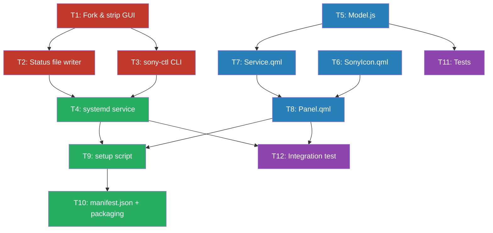

# omarchy-sony — Task List

> Option B: Fork [mos9527/SonyHeadphonesClient](https://github.com/mos9527/SonyHeadphonesClient) into a headless daemon + Omarchy bar-widget plugin.
>
> Reference implementation: [thisisgm/omarchy-pods](https://github.com/thisisgm/omarchy-pods)

---

## Dependency Graph



> [!TIP]
> 🔴 **Daemon tasks** (T1–T4) and 🔵 **Plugin tasks** (T5–T8) can be worked on **in parallel** by different agents. They connect at T9 (setup script) and T12 (integration test).

---

## T1 — Fork & Strip SonyHeadphonesClient into Headless Daemon

| | |
|---|---|
| **Track** | 🔴 Daemon |
| **Effort** | 1–2 days |
| **Depends on** | Nothing |
| **Blocks** | T2, T3 |

### Context
[mos9527/SonyHeadphonesClient](https://github.com/mos9527/SonyHeadphonesClient) is a cross-platform GUI app (C++, cmake, Dear ImGui) that communicates with Sony headphones over Bluetooth RFCOMM using Sony's proprietary v2 protocol. It supports WH-1000XM5. We need the Bluetooth protocol layer **without** the GUI.

### Instructions
1. Clone `https://github.com/mos9527/SonyHeadphonesClient.git` with `--recurse-submodules`
2. Study the source in `Client/`. Identify:
   - The Bluetooth connection layer (RFCOMM socket setup, device discovery)
   - The protocol message encoder/decoder (v2 protocol for XM5)
   - The command handlers: ANC mode, ambient sound level, EQ preset, EQ custom bands, battery query, Speak-to-Chat, DSEE Extreme, multipoint toggle, codec info
3. Remove all GUI code (Dear ImGui, GLEW, GLFW window creation, rendering loop)
4. Refactor into a headless daemon that:
   - Connects to the paired Sony device over RFCOMM on startup
   - Listens for state changes from the headphones (battery, mode changes via physical button, etc.)
   - Reconnects automatically if the Bluetooth connection drops
   - Exposes a clean C++ API (functions/class) for: `getState()`, `setNoiseMode()`, `setAmbientLevel()`, `setEqPreset()`, `setCustomEq()`, `setSpeakToChat()`, `setDsee()`, `setMultipoint()`
5. Update `CMakeLists.txt`: remove ImGui/GLEW/GLFW deps; keep Bluetooth libs (`libbluetooth-dev` on Linux, `libdbus-1-dev`)
6. Ensure it builds on Linux with:
   ```bash
   sudo apt install libbluetooth-dev libdbus-1-dev cmake g++
   cmake -B build -G Ninja
   cmake --build build
   ```

### Output
- `daemon/` directory with clean C++ source
- `daemon/CMakeLists.txt` that builds without GUI dependencies
- A `daemon/UPSTREAM.md` documenting: upstream repo, commit hash forked from, what was removed/changed

### Acceptance Criteria
- [ ] Builds on Linux without any GUI libraries
- [ ] Can connect to a paired WH-1000XM5 and read its battery level
- [ ] Can send a noise-mode-change command and confirm the headphones respond
- [ ] No ImGui, GLEW, GLFW, or windowing code remains

---

## T2 — Status File Writer

| | |
|---|---|
| **Track** | 🔴 Daemon |
| **Effort** | 4–6 hours |
| **Depends on** | T1 |
| **Blocks** | T4, T12 |

### Context
The Omarchy plugin model used by omarchy-pods is **file-based**: the daemon writes state to a JSON file, and the QML panel watches it with `FileView`. The panel never talks to Bluetooth directly.

### Instructions
1. In the daemon (from T1), add a status writer that:
   - Writes to `$XDG_STATE_HOME/sony-headphones/status.json` (fallback: `~/.local/state/sony-headphones/status.json`)
   - Creates parent directories if they don't exist
   - Writes atomically (write to `.tmp`, then `rename()`) to avoid partial reads
   - Updates the file **on every state change** from the headphones (not polling)
   - Removes the file when the daemon exits cleanly
2. The JSON schema must be:
   ```json
   {
     "schema_version": 1,
     "connected": true,
     "device_name": "WH-1000XM5",
     "battery_level": 78,
     "battery_charging": false,
     "noise_mode": "anc",
     "ambient_sound_level": 0,
     "eq_preset": "off",
     "eq_custom_bands": [0, 0, 0, 0, 0],
     "clear_bass": 0,
     "speak_to_chat": true,
     "dsee_extreme": true,
     "multipoint": true,
     "codec": "LDAC",
     "ear_detection": true
   }
   ```
   - `noise_mode`: one of `"anc"`, `"ambient"`, `"wind"`, `"off"`
   - `ambient_sound_level`: integer 0–20
   - `eq_preset`: one of `"off"`, `"bright"`, `"excited"`, `"mellow"`, `"relaxed"`, `"vocal"`, `"treble"`, `"bass"`, `"speech"`, `"custom"`
   - `eq_custom_bands`: array of 5 integers (-10 to +10), only meaningful when eq_preset is `"custom"`
   - `clear_bass`: integer -10 to +10
   - `battery_level`: integer 0–100, or -1 if unknown
3. When the headphones disconnect, write `{"schema_version": 1, "connected": false}` and keep the file (don't delete)

### Output
- Modified daemon source that writes `status.json`
- The daemon should log to stdout/stderr when it writes (for debugging)

### Acceptance Criteria
- [ ] File is created at the correct path when daemon starts and headphones connect
- [ ] File updates within 1 second when you press the NC button on the headphones
- [ ] File is valid JSON at all times (atomic writes)
- [ ] File shows `connected: false` when headphones disconnect

---

## T3 — sony-ctl CLI Tool

| | |
|---|---|
| **Track** | 🔴 Daemon |
| **Effort** | 3–4 hours |
| **Depends on** | T1 |
| **Blocks** | T4 |

### Context
The QML panel needs a way to **send commands** to the headphones. In omarchy-pods, this is done via `librepods-ctl` — a CLI tool that sends commands to the running daemon. We need the equivalent `sony-ctl`.

### Instructions
1. Create a CLI tool `sony-ctl` that communicates with the daemon
2. Communication can be via:
   - **Unix domain socket** (preferred — same as librepods-ctl), OR
   - **D-Bus** (heavier but more standard), OR
   - **Named pipe / simple file protocol** (simplest)
3. Commands to support:
   ```bash
   sony-ctl noise anc          # Set noise cancelling
   sony-ctl noise ambient      # Set ambient sound
   sony-ctl noise wind         # Set wind cancelling
   sony-ctl noise off          # Disable noise control
   sony-ctl ambient-level 15   # Set ambient sound level (0-20)
   sony-ctl eq bright          # Set EQ preset
   sony-ctl eq custom 3 -2 0 1 5 2  # Set custom EQ (5 bands + clear bass)
   sony-ctl speak-to-chat on   # Toggle Speak-to-Chat
   sony-ctl speak-to-chat off
   sony-ctl dsee on            # Toggle DSEE Extreme
   sony-ctl dsee off
   sony-ctl multipoint on      # Toggle multipoint
   sony-ctl multipoint off
   sony-ctl status             # Print current status as JSON (same as status.json)
   ```
4. Exit codes: 0 = success, 1 = command failed, 2 = daemon not running
5. Build as a separate binary in the same cmake project

### Output
- `daemon/src/sony_ctl.cpp` (or equivalent)
- Updated `daemon/CMakeLists.txt` with `sony-ctl` target
- Both `sony-headphones-daemon` and `sony-ctl` installed to `~/.local/bin/`

### Acceptance Criteria
- [ ] `sony-ctl noise anc` changes the headphones to ANC mode
- [ ] `sony-ctl status` prints valid JSON matching the status.json schema
- [ ] `sony-ctl noise anc` returns exit code 2 when daemon is not running
- [ ] Commands complete in under 500ms

---

## T4 — systemd User Service

| | |
|---|---|
| **Track** | 🔴 Daemon |
| **Effort** | 30 min |
| **Depends on** | T2, T3 |
| **Blocks** | T9, T12 |

### Instructions
1. Create `daemon/sony-headphones.service`:
   ```ini
   [Unit]
   Description=Sony Headphones Daemon
   After=bluetooth.target
   PartOf=graphical-session.target

   [Service]
   Type=simple
   ExecStart=%h/.local/bin/sony-headphones-daemon
   Restart=on-failure
   RestartSec=5

   [Install]
   WantedBy=graphical-session.target
   ```
2. Add cmake install rule: install the `.service` file to `~/.local/share/systemd/user/`
3. Ensure daemon handles `SIGTERM` gracefully (cleanup status.json, close BT socket)

### Output
- `daemon/sony-headphones.service`
- Updated `CMakeLists.txt` install rules

### Acceptance Criteria
- [ ] `systemctl --user start sony-headphones` starts the daemon
- [ ] `systemctl --user status sony-headphones` shows it running
- [ ] Daemon restarts automatically after crash
- [ ] Daemon starts on login (after `systemctl --user enable`)

---

## T5 — Model.js (Data Model & Parsing)

| | |
|---|---|
| **Track** | 🔵 Plugin |
| **Effort** | 1–2 hours |
| **Depends on** | Nothing (uses T2's JSON schema as spec) |
| **Blocks** | T7, T11 |

### Context
`Model.js` is a pure JavaScript file with **no QML imports** so it can be tested with Deno. It defines enums, parses `status.json`, and formats display strings.

### Instructions
1. Create `Model.js` following the pattern from [omarchy-pods Model.js](https://github.com/thisisgm/omarchy-pods/blob/main/Model.js)
2. Define enums:
   ```js
   var NOISE_ANC = "anc"
   var NOISE_AMBIENT = "ambient"
   var NOISE_WIND = "wind"
   var NOISE_OFF = "off"
   var NOISE_UNKNOWN = "unknown"
   var LEVEL_UNKNOWN = -1
   var SUPPORTED_SCHEMA = 1
   ```
3. Implement functions:
   ```js
   function defaultStatus()        // Full shape with safe defaults
   function parseStatus(text)      // Parse status.json text → status object
   function noiseModeName(mode)    // "anc" → "Noise Cancelling"
   function noiseModeIcon(mode)    // "anc" → nerd font glyph
   function eqPresetName(preset)   // "bright" → "Bright"
   function batteryIcon(level, charging)  // 78 → "󰂔" (nerd font battery)
   function formatBattery(level)   // 78 → "78%", -1 → "—"
   ```
4. `parseStatus()` must:
   - Handle empty string, invalid JSON, missing fields gracefully
   - Return `defaultStatus()` on any parse failure (never throw)
   - Set `schemaTooNew: true` if `schema_version > SUPPORTED_SCHEMA`

### Output
- `Model.js` — pure JS, no QML imports

### Acceptance Criteria
- [ ] Every function handles null/undefined/garbage input without throwing
- [ ] `parseStatus("")` returns a valid defaultStatus
- [ ] `parseStatus('{"schema_version":99}')` sets `schemaTooNew: true`
- [ ] Runs in Deno without errors: `deno eval 'await import("./Model.js")'`

---

## T6 — SonyIcon.qml

| | |
|---|---|
| **Track** | 🔵 Plugin |
| **Effort** | 1 hour |
| **Depends on** | Nothing |
| **Blocks** | T8 |

### Instructions
1. Create `SonyIcon.qml` — a QML `Item` that draws a simple over-ear headphone silhouette
2. Use a `Canvas` or inline SVG `Path` (not an image file, to match omarchy-pods' approach)
3. Accept properties:
   ```qml
   property real iconSize: 14
   property color iconColor: "white"
   ```
4. The icon should be a **generic over-ear headphone shape** (not Sony-trademarked imagery)
5. Alternatively, use a Nerd Font headphone glyph: `󰋋` (U+F02CB `nf-md-headphones`) — this is the simplest approach and consistent with Omarchy's icon style

### Output
- `SonyIcon.qml`

### Acceptance Criteria
- [ ] Renders a recognizable headphone icon
- [ ] Scales with `iconSize`
- [ ] Respects `iconColor`

---

## T7 — Service.qml (State Watcher)

| | |
|---|---|
| **Track** | 🔵 Plugin |
| **Effort** | 2–3 hours |
| **Depends on** | T5 |
| **Blocks** | T8 |

### Context
`Service.qml` watches `status.json` via Quickshell's `FileView` and exposes reactive properties that `Panel.qml` binds to. It also runs `sony-ctl` commands via `Process`.

### Instructions
1. Create `Service.qml` following [omarchy-pods Service.qml](https://github.com/thisisgm/omarchy-pods/blob/main/Service.qml)
2. Properties to expose:
   ```qml
   property bool connected: false
   property string deviceName: ""
   property int batteryLevel: -1       // 0-100 or -1
   property bool batteryCharging: false
   property string noiseMode: "unknown"  // "anc", "ambient", "wind", "off"
   property int ambientSoundLevel: 0     // 0-20
   property string eqPreset: "off"
   property var eqCustomBands: [0,0,0,0,0]
   property int clearBass: 0
   property bool speakToChat: false
   property bool dseeExtreme: false
   property bool multipoint: false
   property string codec: ""
   property bool earDetection: true
   property bool schemaUnsupported: false
   property string lastError: ""
   ```
3. Watch the status file:
   ```qml
   readonly property string statePath: (Quickshell.env("XDG_STATE_HOME")
     || Quickshell.env("HOME") + "/.local/state") + "/sony-headphones/status.json"
   ```
4. Command functions (using `Process` to call `sony-ctl`):
   ```qml
   function setNoiseMode(mode) { runCtl(["noise", mode]) }
   function setAmbientLevel(level) { runCtl(["ambient-level", String(level)]) }
   function setEqPreset(preset) { runCtl(["eq", preset]) }
   function setSpeakToChat(on) { runCtl(["speak-to-chat", on ? "on" : "off"]) }
   function setDsee(on) { runCtl(["dsee", on ? "on" : "off"]) }
   function setMultipoint(on) { runCtl(["multipoint", on ? "on" : "off"]) }
   function cycleNoiseMode() { /* anc→ambient→off→anc */ }
   ```
5. Implement optimistic updates with a settle timer (same pattern as omarchy-pods: hold pending value for 4 seconds, then let daemon state win)

### Output
- `Service.qml`

### Acceptance Criteria
- [ ] Properties update within 1 second of status.json changing
- [ ] `setNoiseMode("anc")` calls `sony-ctl noise anc`
- [ ] Handles missing status.json gracefully (shows disconnected state)
- [ ] Handles daemon not running (sony-ctl exit code 2)

---

## T8 — Panel.qml (Bar Widget UI)

| | |
|---|---|
| **Track** | 🔵 Plugin |
| **Effort** | 3–5 hours |
| **Depends on** | T5, T6, T7 |
| **Blocks** | T9, T12 |

### Context
The bar widget shows a headphone icon + battery percentage in the Omarchy bar. Clicking it opens a dropdown panel with all controls.

### Instructions
1. Create `Panel.qml` following [omarchy-pods Panel.qml](https://github.com/thisisgm/omarchy-pods/blob/main/Panel.qml)
2. **Bar icon**: Headphone glyph + battery level text (e.g., `󰋋 78%`)
   - Dim icon when disconnected
   - Urgent color when battery ≤ 20%
   - Hide entirely when `hideWhenDisconnected` setting is true and not connected
3. **Dropdown panel sections** (top to bottom):
   - **Header**: Device name + codec badge (e.g., "WH-1000XM5 · LDAC")
   - **Battery**: Single bar with percentage and charging indicator
   - **Noise Control**: Radio-style row for ANC / Ambient / Wind / Off
   - **Ambient Level**: Slider (0–20), visible only when noise_mode is "ambient"
   - **EQ**: Dropdown or radio rows for presets. If "Custom", show 5 sliders + clear bass
   - **Toggles**: Speak-to-Chat, DSEE Extreme, Multipoint — each a labeled switch
   - **Ear Detection**: Toggle
   - **Status line**: Error text or "Daemon not running" guidance
4. **Keyboard navigation**: j/k for up/down, Enter/Space to activate, left/right arrows for sliders
5. **Right-click** on bar icon: cycle noise mode without opening panel
6. **IPC handler**:
   ```qml
   IpcHandler {
     target: "omasony"
     function open(): void { root.open() }
     function close(): void { root.close() }
     function toggle(): void { root.toggle() }
     function noise(): string { pods.cycleNoiseMode(); return "ok" }
     function status(): string { return pods.noiseMode }
   }
   ```

### Output
- `Panel.qml`

### Acceptance Criteria
- [ ] Bar icon shows battery and is clickable
- [ ] Dropdown opens with all sections rendered
- [ ] Clicking ANC/Ambient/Off changes the mode (calls Service.qml)
- [ ] Keyboard navigation works (j/k/Enter)
- [ ] Right-click on bar icon cycles noise mode
- [ ] Panel hides gracefully when headphones disconnect mid-use

---

## T9 — Setup Script

| | |
|---|---|
| **Track** | 🟢 Integration |
| **Effort** | 1 hour |
| **Depends on** | T4, T8 |
| **Blocks** | T10 |

### Instructions
1. Create `setup` script (bash, executable):
   ```bash
   #!/bin/bash
   set -euo pipefail

   root=$(cd "$(dirname "$0")" && pwd)
   daemon="$root/daemon"

   # Install build deps
   omarchy pkg add cmake ninja libbluetooth-dev libdbus-1-dev

   # Build daemon
   cmake -S "$daemon" -B "$daemon/build" -G Ninja
   cmake --build "$daemon/build"
   cmake --install "$daemon/build" --prefix "$HOME/.local"

   # Enable service
   systemctl --user daemon-reload
   systemctl --user enable sony-headphones.service
   systemctl --user restart sony-headphones.service
   ```
2. Make idempotent — safe to run multiple times
3. Should work with `omarchy plugin add <url> --enable <path>/setup`

### Output
- `setup` (executable bash script)

### Acceptance Criteria
- [ ] Running `setup` on a clean system installs all deps, builds, and starts the daemon
- [ ] Running `setup` a second time succeeds without errors
- [ ] After setup, `sony-ctl status` returns valid JSON

---

## T10 — manifest.json & Packaging

| | |
|---|---|
| **Track** | 🟢 Integration |
| **Effort** | 30 min |
| **Depends on** | T9 |
| **Blocks** | Nothing |

### Instructions
1. Create `manifest.json`:
   ```json
   {
     "schemaVersion": 1,
     "id": "io.github.roykevin.omasony",
     "name": "Sony Headphones",
     "version": "0.1.0",
     "author": "roykevin",
     "license": "MIT",
     "description": "Sony WH-1000XM5 in the Omarchy bar: battery, ANC, ambient sound, EQ, and more.",
     "kinds": ["bar-widget"],
     "entryPoints": {
       "barWidget": "Panel.qml"
     },
     "barWidget": {
       "displayName": "Sony",
       "description": "Battery, noise cancelling, EQ and more for Sony WH-1000XM5."
     }
   }
   ```
2. Create `README.md` with install instructions, screenshots placeholder, feature list
3. Create `LICENSE` (MIT for plugin; note daemon may be different depending on upstream)
4. Verify install flow:
   ```bash
   omarchy plugin add https://github.com/roykevin/omarchy-sony --enable ~/.config/omarchy/plugins/io.github.roykevin.omasony/setup
   ```

### Output
- `manifest.json`, `README.md`, `LICENSE`

### Acceptance Criteria
- [ ] `omarchy plugin add` installs and enables successfully
- [ ] Widget appears in bar after shell restart

---

## T11 — Unit Tests for Model.js

| | |
|---|---|
| **Track** | 🟣 Testing |
| **Effort** | 1–2 hours |
| **Depends on** | T5 |
| **Blocks** | Nothing |

### Instructions
1. Create `tests/model.test.js` following [omarchy-pods tests](https://github.com/thisisgm/omarchy-pods/blob/main/tests/model.test.js)
2. Test cases:
   - `parseStatus("")` → returns defaultStatus with `ok: false`
   - `parseStatus("not json")` → returns defaultStatus with `ok: false`
   - `parseStatus('{"schema_version":1,"connected":true,"battery_level":78}')` → correct values
   - `parseStatus('{"schema_version":99}')` → `schemaTooNew: true`
   - All `noiseModeName()` values
   - All `eqPresetName()` values
   - `batteryIcon()` at various levels and charging states
   - `formatBattery(-1)` → `"—"`
   - `formatBattery(0)` → `"0%"`
3. Run with: `deno run --allow-read tests/model.test.js`

### Output
- `tests/model.test.js`

### Acceptance Criteria
- [ ] All tests pass with `deno run --allow-read tests/model.test.js`
- [ ] Exit code 0 on pass, non-zero on failure

---

## T12 — End-to-End Integration Test

| | |
|---|---|
| **Track** | 🟣 Testing |
| **Effort** | 2–3 hours |
| **Depends on** | T4, T8 |
| **Blocks** | Nothing |

### Instructions
1. Write a test script that:
   - Writes a fake `status.json` to the expected path (no real headphones needed)
   - Verifies the panel reads it (check via IPC: `omarchy ipc omasony status`)
   - Writes an updated status.json and verifies the panel reflects the change
   - Tests error states: missing file, invalid JSON, schema too new
2. Also manually test with real WH-1000XM5 hardware:
   - Connect headphones → verify icon appears
   - Toggle ANC via panel → verify headphones change mode
   - Press physical NC button → verify panel updates
   - Disconnect headphones → verify panel shows disconnected

### Output
- `tests/integration.sh`
- Manual test checklist in `tests/MANUAL.md`

### Acceptance Criteria
- [ ] Fake-status script runs without real hardware
- [ ] Manual test checklist passes with real WH-1000XM5

---

## Summary Table

| Task | Track | Effort | Depends On | Can Parallelize With |
|------|-------|--------|-----------|---------------------|
| **T1** Fork & strip GUI | 🔴 Daemon | 1–2 days | — | T5, T6 |
| **T2** Status file writer | 🔴 Daemon | 4–6 hrs | T1 | T5, T6, T7 |
| **T3** sony-ctl CLI | 🔴 Daemon | 3–4 hrs | T1 | T5, T6, T7 |
| **T4** systemd service | 🔴 Daemon | 30 min | T2, T3 | T8 |
| **T5** Model.js | 🔵 Plugin | 1–2 hrs | — | T1, T2, T3 |
| **T6** SonyIcon.qml | 🔵 Plugin | 1 hr | — | T1, T2, T3 |
| **T7** Service.qml | 🔵 Plugin | 2–3 hrs | T5 | T2, T3 |
| **T8** Panel.qml | 🔵 Plugin | 3–5 hrs | T5, T6, T7 | T4 |
| **T9** Setup script | 🟢 Integration | 1 hr | T4, T8 | — |
| **T10** Manifest + packaging | 🟢 Integration | 30 min | T9 | — |
| **T11** Model.js tests | 🟣 Testing | 1–2 hrs | T5 | anything |
| **T12** Integration test | 🟣 Testing | 2–3 hrs | T4, T8 | — |

> **Total: ~3–5 days** with parallelization across daemon and plugin tracks.
