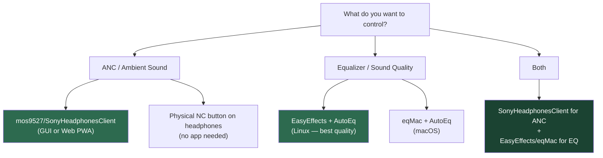

# Managing Sony WH-1000XM5 on PC / Linux / Mac — Open Source Options

## Background

The official **Sony | Sound Connect** app (formerly "Headphones Connect") is only available on Android and iOS. There is **no official Sony desktop app** for managing WH-1000XM5 settings like noise cancellation, ambient sound, or EQ. However, several open-source community projects fill this gap.

> [!TIP]
> **TL;DR — Yes, good open-source options exist.** The best approach is a combination of the **mos9527 SonyHeadphonesClient fork** (for ANC/ambient control) and **EasyEffects + AutoEq** (for superior EQ on Linux).

---

## Open Source Tools — Comparison

| Tool | Platform | XM5 Support | Features | UI | Maturity |
|------|----------|-------------|----------|-----|---------|
| **mos9527/SonyHeadphonesClient** | Windows, Linux, macOS, Web | ✅ Yes (v2 protocol) | ANC, Ambient Sound, EQ, Battery | GUI + Web PWA | Active fork, community-maintained |
| **Plutoberth/SonyHeadphonesClient** | Windows, Linux, macOS | ❌ No (archived) | ANC, Ambient Sound, EQ, Battery | GUI | Archived, XM3 only |
| **EasyEffects** | Linux (PipeWire) | ✅ (system-wide EQ) | Parametric EQ, Convolver, Compressor, etc. | GUI | Mature, widely used |
| **AutoEq** | Cross-platform (profiles) | ✅ (headphone profiles) | Frequency response correction | N/A (data) | Mature, actively updated |
| **sony-headphones-control-py** | Linux, macOS | ⚠️ Partial | ANC toggle via CLI | CLI | Small project |

---

## 1. SonyHeadphonesClient (mos9527 Fork) — ⭐ Recommended for Device Control

> [!IMPORTANT]
> The **original** [Plutoberth/SonyHeadphonesClient](https://github.com/Plutoberth/SonyHeadphonesClient) is **archived** and does **NOT** support the WH-1000XM5. You need the **mos9527 fork**, which implements Sony's newer **v2 Bluetooth protocol** required by XM4/XM5 devices.

### Links
- **GitHub**: [mos9527/SonyHeadphonesClient](https://github.com/mos9527/SonyHeadphonesClient)
- **Web PWA (easiest to try)**: [https://mos9527.com/SonyHeadphonesClient/](https://mos9527.com/SonyHeadphonesClient/)

### What It Can Do
- ✅ Toggle **Noise Cancelling** / **Ambient Sound** / **Off** modes
- ✅ Adjust **Ambient Sound Level**
- ✅ View **battery level**
- ✅ Modify **EQ presets**
- ✅ Cross-platform: Windows, Linux, macOS native builds + Web version

### How to Use

#### Option A: Web PWA (Fastest — No Install)
1. Open [https://mos9527.com/SonyHeadphonesClient/](https://mos9527.com/SonyHeadphonesClient/) in a **Web Serial/Bluetooth-capable browser** (Chrome/Edge recommended)
2. Pair your XM5 normally via your OS Bluetooth settings
3. Click "Connect" in the web app and select your headphones
4. Adjust settings directly in the browser

#### Option B: Build from Source (Native)

**Linux (Debian/Ubuntu):**
```bash
# Install dependencies
sudo apt install libbluetooth-dev libglew-dev libglfw3-dev libdbus-1-dev cmake g++

# Clone and build
git clone --recurse-submodules https://github.com/mos9527/SonyHeadphonesClient.git
cd SonyHeadphonesClient/Client
mkdir build && cd build
cmake ..
cmake --build .
```

**macOS:**
```bash
# Clone
git clone --recurse-submodules https://github.com/mos9527/SonyHeadphonesClient.git
# Open the provided xcodeproj in Xcode and build
```

**Windows:**
```powershell
# Requires cmake and Visual Studio 2022 with C++ tools
git clone --recurse-submodules https://github.com/mos9527/SonyHeadphonesClient.git
cd SonyHeadphonesClient\Client
mkdir build && cd build
cmake ..
cmake --build .
```

> [!NOTE]
> This is a **community reverse-engineering project** — not affiliated with Sony. It works by sending Bluetooth RFCOMM messages using the same protocol as the official app.

---

## 2. EasyEffects + AutoEq — ⭐ Recommended for Sound Quality (Linux)

If your primary goal is **better sound quality / EQ**, this combo is actually **superior** to the built-in Sony app EQ, which is limited to basic presets.

### What It Can Do
- ✅ **Parametric EQ** with unlimited bands (vs. Sony's ~5 fixed bands)
- ✅ **AutoEq profiles** tuned specifically for WH-1000XM5 (Harman target, diffuse field, etc.)
- ✅ **Convolver** support for impulse response correction
- ✅ **Compressor, limiter, reverb** and many more audio effects
- ❌ Cannot control ANC/Ambient Sound (that's a device-level feature)

### Setup on Linux

```bash
# Install EasyEffects (requires PipeWire audio server)
# Debian/Ubuntu 22.04+:
sudo apt install easyeffects

# Fedora:
sudo dnf install easyeffects

# Flatpak (universal):
flatpak install flathub com.github.wwmm.easyeffects
```

### Import AutoEq Profile
1. Go to [https://autoeq.app/](https://autoeq.app/)
2. Search for **"Sony WH-1000XM5"**
3. Select **"Parametric EQ"** as the output format
4. Download the profile
5. In EasyEffects → Output → Add **Equalizer** effect → **Import** the downloaded profile
6. Adjust the **Preamp** (negative value) if you hear distortion

> [!TIP]
> For the absolute best quality, use the **Convolver** approach: download the impulse response `.wav` file from the [AutoEq GitHub repo](https://github.com/jaakkopasanen/AutoEq), then load it in EasyEffects' Convolver effect. This gives a more precise correction than parametric EQ.

### macOS Alternative
On macOS, you can use **[eqMac](https://eqmac.app/)** (open source system-wide EQ) or **[SoundSource](https://rogueamoeba.com/soundsource/)** (paid, but excellent) with AutoEq profiles.

---

## 3. CLI Tools — For Power Users / Automation

### sony-headphones-control-py
A lightweight Python CLI for toggling noise cancellation modes.

```bash
pip install sony-headphones-control  # or clone from GitHub

# Toggle noise cancelling
sony-headphones-control --mode noise-cancelling
sony-headphones-control --mode ambient-sound
sony-headphones-control --mode disable
```

### Custom Bluetooth Scripts
Some users write custom Python scripts that auto-configure the headphones on Bluetooth connection:

```python
# Example: Auto-set ANC on connect (conceptual)
import bluetooth

# Send Sony's proprietary RFCOMM "magic payload" to enable ANC
# (protocol details available in SonyHeadphonesClient source code)
```

This approach is useful for **automation** (e.g., auto-enable ANC when headphones connect to your PC).

---

## 4. If No Open Source Works — Fallback Options

> [!NOTE]
> The open-source options above are solid, but if they don't work for your specific use case, here are fallbacks:

| Approach | Details |
|----------|---------|
| **Android emulator** | Run Sony Sound Connect in an Android emulator (e.g., Waydroid on Linux, BlueStacks on Windows). Bluetooth passthrough can be tricky. |
| **Phone as remote** | Keep using the official Sony Sound Connect app on your phone to configure settings. Once set, the headphones remember the last ANC/EQ configuration when connecting to your PC. |
| **Physical buttons** | The XM5 has a dedicated **NC/Ambient** button. Press it to cycle through: Noise Cancelling → Ambient Sound → Off. This covers the most common need without any app. |
| **Firmware updates** | For firmware updates, the Sony Sound Connect mobile app is still required — no open-source alternative exists for firmware flashing. |

---

## Recommendation Summary



## Open Questions

> [!IMPORTANT]
> **Which platform are you primarily using?** The recommended setup differs slightly:
> - **Linux** → Full open-source stack available (SonyHeadphonesClient + EasyEffects + AutoEq)
> - **macOS** → SonyHeadphonesClient works; use eqMac for system EQ
> - **Windows** → SonyHeadphonesClient works; use EqualizerAPO + Peace GUI for system EQ

> [!IMPORTANT]
> **What features matter most to you?**
> - If mainly **ANC control** → SonyHeadphonesClient or just use the physical button
> - If mainly **EQ/sound quality** → EasyEffects + AutoEq (far better than Sony's built-in EQ)
> - If **firmware updates** → You'll still need the Sony Sound Connect mobile app occasionally
